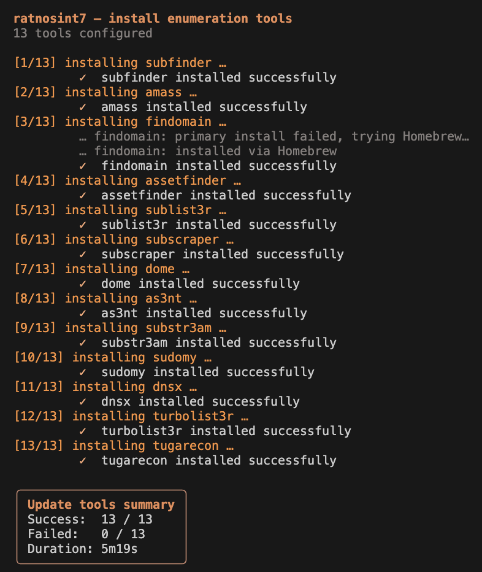
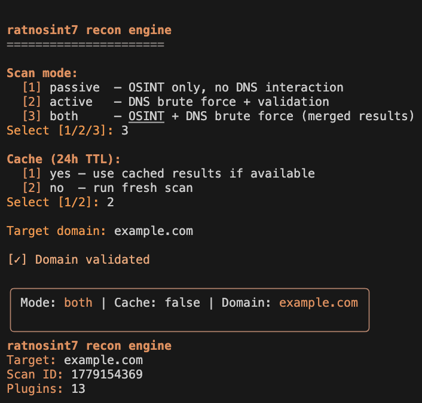
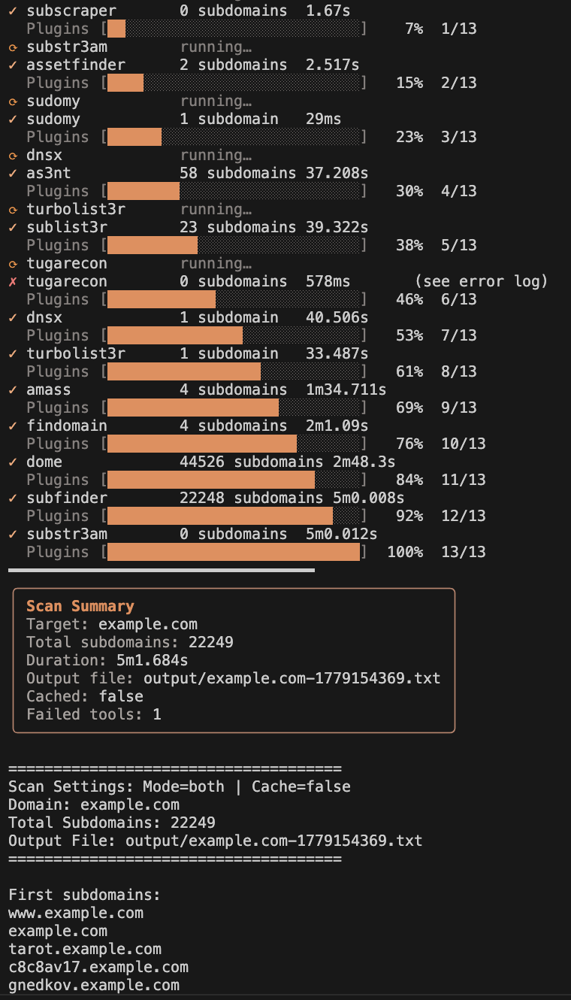

<p align="center">


<div align="center">

# RATNOSINT7

### Modular Reconnaissance & OSINT Framework


<br>


</div>

High-performance Go subdomain reconnaissance orchestration engine. Runs 13 enumeration tools **concurrently**, deduplicates results, and streams to disk. Zero intermediate buffers.

⚠️ **DISCLAIMER**: This tool performs active subdomain enumeration including DNS brute-forcing. **Do NOT run in production environments** without:
- **Explicit written authorization** from domain owner
- **Prior understanding** of all integrated tools and their capabilities
- **Network policies** allowing DNS reconnaissance traffic
- **Compliance review** for your jurisdiction (especially CFAA, GDPR, CCPA)

Unauthorized reconnaissance is illegal. Misuse may result in legal liability. Use only in authorized penetration tests, bug bounty programs, or personal domains you own.

## Features

| Feature | Description |
|---------|-------------|
| **Full Parallelism** | All 13 tools run concurrently; no worker queue bottleneck |
| **Streaming Pipeline** | Plugins → Parser → Dedupe → Writer (atomic, zero-copy) |
| **Smart Caching** | `~/.ratnosint7/cache/` with config-aware keys (24h TTL) |
| **Multi-Format Output** | txt, json, csv exports for integration |
| **Production-Safe** | Atomic writes, goroutine leak fixes, context-aware channels |
| **High Performance** | FNV-1a hashing, lock-free dedupe (32 shards), 64KB+ buffers |
| **Modern CLI** | Cobra-based commands, interactive prompts, rich terminal UI |

## Architecture

```
┌─────────────────────────────────────────────────────────────────┐
│  Domain → [All 13 Plugins Parallel] → Raw Output (64KB buf)     │
│                          ↓                                       │
│           [Parser Pool - 16 workers] → Parsed (32KB buf)        │
│                          ↓                                       │
│     [Dedupe Shards - 32 shards, fnv-1a] → Unique (16KB buf)     │
│                          ↓                                       │
│     [Atomic Writer] .tmp → rename → output/{domain}.txt         │
│                          ↓                                       │
│              [Cache] ~/.ratnosint7/cache/                        │
└─────────────────────────────────────────────────────────────────┘
```

**Pipeline Design:**
- **Plugin Layer**: Each tool spawns goroutine, sends raw results to channel
- **Parser**: 16 workers normalize domains (RFC 1123 validation, deduplication prep)
- **Dedupe**: 32 sharded maps (fnv-1a hash), lock-free reads for concurrency
- **Atomic Writer**: bufio streaming to .tmp, atomic rename on close, supports txt/json/csv

## Installation & Setup

### System Requirements

**Supported Operating Systems:**
- **macOS** (Intel x86_64 and Apple Silicon M1/M2/M3+)
- **Linux** (x86_64, arm64; Debian/Ubuntu, RHEL/CentOS, Alpine)
- **Windows** (WSL2 recommended; native Windows support limited)

**Core Requirements:**
- **Go 1.21+** (required to build; check: `go version`)
- **Git** (required for cloning; check: `git --version`)
- **Python 3.12** (`python3.12` on PATH) — **required for tugarecon**; macOS system Python 3.9 is not supported
- **~500MB disk space** (binary ~20MB + tool installs ~200-300MB + cache directory)
- **Outbound HTTPS network access** (for API queries, tool downloads)

**Per-Tool Dependencies:**

| Tool | Type | Requirements | Notes |
|---|---|---|---|
| subfinder | Go | Go 1.21+ | Auto-installed via `go install` |
| amass | Go | Go 1.21+ | Auto-installed via `go install` |
| findomain | Rust | Rust + cargo | Install: https://rustup.rs/ |
| assetfinder | Go | Go 1.21+ | Auto-installed via `go install` |
| sublist3r | Python | Python 3.8+, pip3 | Auto-cloned + `pip3 install -r requirements.txt` |
| subscraper | Python | Python 3.8+, pip3 | Auto-cloned + `pip3 install -r requirements.txt` |
| sudomy | Python | Python 3.8+, pip3 | Auto-cloned + `pip3 install -r requirements.txt` |
| turbolist3r | Python | Python 3.8+, pip3 | Auto-cloned from [fleetcaptain/Turbolist3r](https://github.com/fleetcaptain/Turbolist3r) + `pip3 install -r requirements.txt` |
| tugarecon | Python | **Python 3.12** (`python3.12`) | [skynet0x01/tugarecon](https://github.com/skynet0x01/tugarecon); deps install into `~/.ratnosint7/tools/tugarecon/.venv` (not system pip) |
| dome | Python | Python 3.8+, pip3 | Auto-cloned + `pip3 install -r requirements.txt` |
| as3nt | Python | Python 3.8+, pip3 | Auto-cloned + `pip3 install -r requirements.txt` |
| substr3am | Python | Python 3.8+, pip3 | Auto-cloned + `pip3 install -r requirements.txt` |
| dnsx | Go | Go 1.21+ | Auto-installed via `go install` |

**Python Environment (if using Python tools):**
- **Python 3.8+** for most Python tools (check: `python3 --version`)
- **Python 3.12** for **tugarecon** only (check: `python3.12 --version`; install: `brew install python@3.12`)
- **pip3** for most Python tools (installed into each tool's clone directory)
- **tugarecon** dependencies are installed automatically into `~/.ratnosint7/tools/tugarecon/.venv` by `update-tools`
- Some Python packages require **build tools**:
  - macOS: `xcode-select --install` (Xcode Command Line Tools)
  - Ubuntu/Debian: `sudo apt-get install build-essential python3-dev`
  - RHEL/CentOS: `sudo yum groupinstall "Development Tools" && sudo yum install python3-devel`

**Optional but Recommended:**
- Rust toolchain (if findomain fails with "cargo not found"): https://rustup.rs/
- Docker (alternative to native install if dependencies are hard to set up)

### Option 1: Global Install (Easiest)

```bash
# Install ratnosint7 globally
go install github.com/Ratnadeepdeyroy/ratnosint7/cmd/ratnosint7@latest

# Install all enumeration tools (~5-10 min, some require pip/cargo/go)
ratnosint7 update-tools
```

### Option 2: Fresh Local Build

```bash
# Clone repo
git clone https://github.com/Ratnadeepdeyroy/ratnosint7
cd ratnosint7/ratnosint7

# Automated setup (installs deps + builds + installs tools)
bash setup.sh

# OR manual steps:
# go build -o ratnosint7 ./cmd/ratnosint7
# ./ratnosint7 update-tools
```

**Makefile shortcuts:**
```bash
make setup        # Full setup (deps + build + tools)
make build        # Build binary
make build-clean  # Clean rebuild
make install-tools # Install/update tools
make run          # Run scan
```

### Verify Installation

```bash
# Check binary
./ratnosint7 scan --help

# List installed tools (if any failed, update-tools shows which)
./ratnosint7 update-tools  # Run again; idempotent
```



## Running Your First Scan

All scans run in **interactive mode** with colorful prompts for scan settings.

**Quick Start:**
```bash
./ratnosint7 scan  # Interactive prompts for mode, cache, domain
```



```bash
# Start an interactive scan
./ratnosint7 scan

# Follow prompts:
# ratnosint7 recon engine
# ======================
#
# Scan mode:
#   [1] passive  — OSINT only, no DNS interaction
#   [2] active   — DNS brute force + validation
#   [3] both     — OSINT + DNS brute force (merged results)
# Select [1/2/3]: 1
#
# Cache (24h TTL):
#   [1] yes — use cached results if available
#   [2] no  — run fresh scan
# Select [1/2]: 2
#
# Target domain: example.com
#
# [✓] Domain validated
#
# Mode: passive | Cache: false | Domain: example.com
#
# [Tool progress shows as each plugin completes...]
# 
# scan complete | press any key to exit
```

After scan completes, first 50 subdomains display in terminal, then results saved to: `output/example.com-<timestamp>.txt`



### Command-line Flags

Flags override prompts for mode and output format:

```bash
# Passive mode, no cache
./ratnosint7 scan --passive

# Active mode, enable cache
./ratnosint7 scan --active --cache

# Both modes — passive + active, merged and deduplicated
./ratnosint7 scan --both

# JSON output
./ratnosint7 scan --format json

# CSV output for import
./ratnosint7 scan --format csv

# Fullscreen TUI dashboard (default is inline text progress)
./ratnosint7 scan --no-dashboard=false
```

**Scan UI (TTY):** By default (`--no-dashboard=true`), scans use **inline text mode** (`[n/13]` progress, per-plugin lines, scrollback preserved). Pass **`--no-dashboard=false`** on an interactive terminal to use the **fullscreen Bubble Tea dashboard** (`pkg/ui/tui`).

### Understanding Scan Modes

**Passive** (12 tools)
- Queries public sources: DNS cert logs, APIs, search engines
- No DNS brute-force against the target (stealthier)
- Typical runtime ~5 min (per-tool timeout)
- Tools: subfinder, amass, findomain, assetfinder, sublist3r, subscraper, dome, as3nt, substr3am, sudomy, turbolist3r, tugarecon (OSINT mode)

**Active** (13 tools — includes all passive-capable tools that define `active_run`, plus dnsx)
- Adds DNS brute-force / resolution where configured
- Requires authorization for DNS interaction against the target
- Typical runtime ~5 min
- Tools: subfinder -active, amass -active -brute, findomain --resolved, dnsx, tugarecon -b, plus passive-only tools still run their passive commands when selected in active mode

**Both** (up to 13 tools — all tools that have `passive_run`, `active_run`, or both)
- Runs passive and active commands concurrently per tool, merges results into one deduplicated output
- Broadest coverage in a single scan — discovers subdomains unique to each mode
- Requires authorization (same as active — DNS brute-force runs)
- Use `--both` flag or select `[3]` at the interactive prompt

## CLI Flags

```bash
ratnosint7 scan [flags]
```

**Domain**: Provided via interactive prompt. Flags override scan mode and output format only.

| Flag | Default | Description |
|------|---------|-------------|
| `--passive` | — | Run only passive plugins (skips mode prompt) |
| `--active` | — | Run only active plugins (skips mode prompt) |
| `--both` | — | Run passive + active plugins concurrently, merge results (skips mode prompt) |
| `--cache` | false | Use cached results (24h TTL) |
| `--timeout DURATION` | 30m | Max scan time (e.g. `2h`, `5m`) |
| `--format txt\|json\|csv` | txt | Output format |
| `--overwrite` | false | Overwrite output (no timestamp) |
| `--no-dashboard` | **true** | When true (default): inline text UI with progress bars. Set `--no-dashboard=false` for fullscreen TUI dashboard (TTY only) |
| `--pprof` | false | Start pprof on :6060 |
| `--config PATH` | configs | Config directory |
| `--verbose` | false | Info logging |
| `--debug` | false | Debug logging |
| `--quiet` | false | Warnings only |
| `--silent` | false | No CLI UI output (file still written) |

## Configuration

### tools.yaml
Defines enumeration tools. Each tool declares mode-specific commands (passive_run, active_run, or both).

Pre-configured tools (**13** in `configs/tools.yaml`):
- **Passive + Active**: subfinder, amass, findomain, tugarecon
- **Passive only**: assetfinder, sublist3r, subscraper, dome, as3nt, substr3am, sudomy, turbolist3r
- **Active only**: dnsx

**Passive scan** runs every tool with a `passive_run` command (12 tools). **Active scan** runs tools with `active_run` when set, otherwise falls back to `passive_run`, and always includes dnsx (13 plugins). **Both scan** runs any tool that has `passive_run`, `active_run`, or both — passive and active commands run concurrently per tool, results merged and deduplicated.

Example entry (both modes):
```yaml
- name: amass
  version: v4.2.0
  install: go install github.com/owasp-amass/amass/v4/...@v4.2.0
  passive_run: amass enum -passive -d {domain}
  active_run: amass enum -active -brute -d {domain}
  rate_limit: 5

- name: assetfinder
  version: v0.1.1
  install: go install github.com/tomnomnom/assetfinder@v0.1.1
  passive_run: assetfinder --subs-only {domain}
  rate_limit: 2
```

### resolvers.txt
Optional DNS resolvers (one IP per line). Passed to amass for custom resolution. Leave empty to skip.

### config.yaml
Optional performance tuning. Defaults tuned for 8-core CPU + 13 tools:

```yaml
raw_buffer: 65536         # 64KB buffering between plugins and parser
parsed_buffer: 32768      # 32KB between parser and dedupe
unique_buffer: 16384      # 16KB between dedupe and writer
parser_workers: 16        # Parallel normalizers (RFC 1123 validation)
timeout_minutes: 5        # Per-domain scan timeout
```

Increase buffers if tools output spikes (>10k domains/sec). Increase parser_workers on high-core systems.

## Performance

| Metric | Value | Notes |
|--------|-------|-------|
| **Throughput** | ~22k subdomains/5min | 13 tools, 8-core CPU, 64KB buffers |
| **Memory** | 100-300 MB | Streaming = zero intermediate buffering |
| **Cache Hit** | ~1ms | In-memory lookup |
| **Cache Miss** | ~5 min | All 13 tools run concurrently |
| **Bottleneck** | amass (5min timeout) | Others finish faster, write immediately |

**Scaling**: Parallelism scales linearly up to CPU cores. Add tools → faster scans.

## Reliability

**No data loss**:
- Atomic output writes (crash-safe)
- Atomic cache writes (no corruption on interrupt)
- All errors logged; failed tools reported
- Error logs saved to: `~/.ratnosint7/logs/errors_*.log` (plugin name, error reason, fix suggestions)

**No goroutine leaks**:
- Context-aware channel ops (all sends check ctx.Done())
- Panic recovery drains channels
- Ratelimiter stops on ctx.Done()

**No hung scans**:
- Parent context deadline respected (per-tool timeout never exceeds global)
- Slow tool kills logged on timeout
- Context cancellation propagates to all workers

**Error Logging**:
- Every scan that encounters plugin failures creates timestamped error log
- Error logs include: plugin name, error code, reason, suggested fix
- Access: `ls ~/.ratnosint7/logs/` to find recent error files

## Troubleshooting

### Build Issues

**`go: command not found`**
- Install Go 1.21+: https://golang.org/dl/

**`cannot find module`**
```bash
go mod download
go mod tidy
go build ./...
```

### Tool Installation Issues

**Tools fail to install:**
```bash
./ratnosint7 update-tools  # [n/13] per tool + OK/FAIL + summary
./ratnosint7 update-tools --verbose  # Full error text on failure
```

Each tool prints `[n/13] installing <name> …` then `✓ installed successfully` or `✗ installation failed` with a fix hint.

**Missing dependencies:**
- Python tools (most): `python3`, `pip3` on PATH
- **tugarecon**: `python3.12` on PATH (`brew install python@3.12`); `update-tools` creates `~/.ratnosint7/tools/tugarecon/.venv` (do not `pip install` into system Python)
- Go tools: Go 1.21+
- Rust tools (findomain): `cargo` or Homebrew/GitHub fallback via `update-tools`

**Idempotent re-install** (safe to run multiple times):
```bash
./ratnosint7 update-tools  # Overwrites old dirs, installs fresh
```

### Scan Issues

**"No plugins available"**
- No tools installed: Run `./ratnosint7 update-tools`
- Mode filter excludes all: Try opposite mode (`--passive` ↔ `--active`) or use `--both`

**Slow scans**
- First run: No cache. Subsequent runs use cache (1ms vs ~5min)
- Slow tool: Amass passive timeout ~5min. Expected.
- Check logs: `./ratnosint7 scan example.com --verbose`

**Empty output**
- Check cache: `rm -rf ~/.ratnosint7/cache/ && rescan`
- Check domain validity: `./ratnosint7 scan invalid..domain` (shows validation error)
- Check permissions: `output/` directory writable?

**"invalid domain" error**
- Domain must match RFC 1123 (alphanumeric + hyphens + dots)
- No URLs (`http://`), no IPs, no single labels

### Tool-Specific Errors

**Findomain: `exec: "findomain": executable file not found in $PATH`**
- Install from Rust: https://rustup.rs/
- macOS (preferred): `brew install findomain`
- Linux: `cargo install findomain` (requires Rust)
- Or reinstall: `./ratnosint7 update-tools --verbose`

**Any tool fails during scan:**
- Error log: `~/.ratnosint7/logs/errors_*.log` (shows plugin, error reason, fix)
- Reinstall all tools: `./ratnosint7 update-tools` (idempotent, safe to retry)
- Check verbosely: `./ratnosint7 update-tools --verbose` (shows each tool's output)

**tugarecon: Python 3.12 / virtualenv**
- `python3.12: not found` → `brew install python@3.12` and ensure `/opt/homebrew/bin` is on PATH
- `externally-managed-environment` → rebuild ratnosint7 and run `update-tools` (uses `.venv`, not system pip)
- `missing virtualenv` → run `./ratnosint7 update-tools` after Python 3.12 is installed

## Known Limitations

- **No --resume**: Scan interruption = restart. Future: checkpoint-based resume.
- **No --sort**: Streaming incompatible with sorting; would require buffering full results.
- **Tool dependencies**: Some tools require pip, cargo, go. `update-tools` shows install errors.
- **Active scans require auth**: DNS brute-force (dnsx, amass -active) needs explicit domain owner permission.

## Output Examples

### Text Format (Default)
```
$ ./ratnosint7 scan example.com --passive --cache

### JSON Format
```bash
./ratnosint7 scan example.com --format json
```

```json
[
  "api.example.com",
  "app.example.com",
  "auth.example.com"
]
```

### CSV Format
```bash
./ratnosint7 scan example.com --format csv
```

```
subdomain
api.example.com
app.example.com
auth.example.com
```

## Legal & Ethics

### When Authorized ✅
- **Your own domain**: Always safe (OSINT + active)
- **Bug bounty programs**: Follow program rules (usually passive only)
- **Penetration testing**: With written engagement agreement
- **Security research**: On test domains you control

### When NOT Authorized ❌
- **No permission**: Illegal reconnaissance 
- **Passive only programs**: Active modes (DNS brute force) violate terms
- **Network policies**: Check if your ISP/network allows enumeration traffic
- **Production targets**: Without signed statement of work

### Best Practices
1. **Get written authorization** before any scan (even OSINT)
2. **Document tool behavior**: Understand each tool's traffic patterns
3. **Test on own domain first**: Verify output quality before client scans
4. **Check legal jurisdiction**: CFAA (USA), GDPR (EU), CCPA (CA) have different rules
5. **Rate limiting**: Passive scans are stealthy; active scans may trigger IDS

**You are responsible for your use of this tool.** Misuse may result in legal liability, account suspension, or law enforcement action.

## License

Apache 2.0. See [LICENSE](LICENSE).

---

<div align="center">

**Built with ❤️ for security researchers, penetration testers, and bug bounty hunters.**

[Report Issues](../../issues) • [Discussions](../../discussions) • [Security Policy](SECURITY.md)

</div>

## Integrated Enumeration Tools

**13 open-source tools** (all optional, install selectively if desired):

### OSINT / Passive Only (Safe, no DNS to target)
| Tool | Type | Speed | Coverage | Notes |
|---|---|---|---|---|
| **subfinder** | Go | Fast | Excellent | Queries 30+ public sources |
| **assetfinder** | Go | Fast | Good | crt.sh + other sources |
| **sublist3r** | Python | Moderate | Good | Queries multiple public APIs |
| **subscraper** | Python | Moderate | Fair | Passive module aggregation |
| **turbolist3r** | Python | Moderate | Fair | Fast list aggregation |
| **dome** | Python | Slow | Fair | OSINT scanning framework |
| **as3nt** | Python | Slow | Fair | AWS S3 enumeration focus |
| **substr3am** | Python | Slow | Fair | Passive subdomain finder |

### Passive + Active (OSINT + DNS brute-force)
| Tool | Type | Speed | Passive | Active |
|---|---|---|---|---|
| **amass** | Go | Slow | OSINT sources, cert logs | DNS brute force + permutations |
| **findomain** | Rust | Very Fast | Fast API-based lookup | DNS resolution + validation |
| **sudomy** | Python | Moderate | Multi-source OSINT | DNS brute force + validation |
| **tugarecon** | Python 3.12 | Moderate | OSINT modules (`.venv`) | Brute force (`-b`, `.venv`) |

### Active Only / DNS Validation (Requires Authorization)
| Tool | Type | Speed | Purpose |
|---|---|---|---|
| **dnsx** | Go | Very Fast | Brute-force with wordlist |

**Install status check:**
```bash
./ratnosint7 update-tools
# Shows: ✓ tool (installed) or ✗ tool (failed, missing deps)
```

**Remove/disable tool:** Edit `configs/tools.yaml`, comment out or delete tool entry.

See [THIRD_PARTY_TOOLS.md](THIRD_PARTY_TOOLS.md) for licenses & attribution.

## Contributing

Issues and PRs: https://github.com/Ratnadeepdeyroy/ratnosint7
